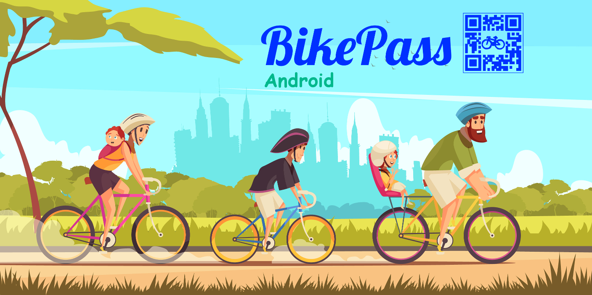
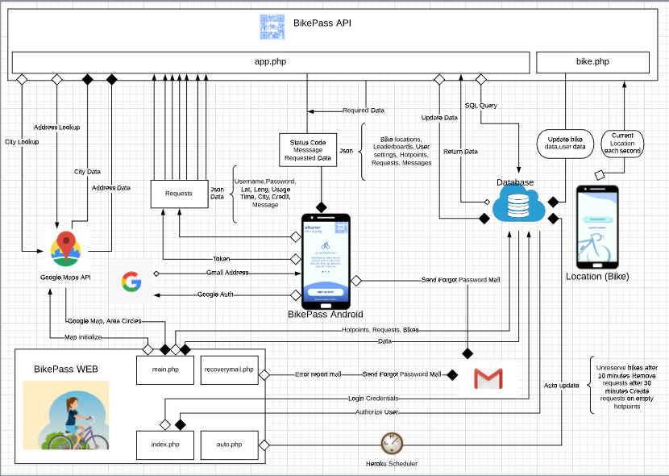

## What is BikePass ?

Bikepass is new way of transport with bike sharing and paying for amount you used ! :open_mouth:  

With BikePass Android application you can easily sign up :white_check_mark: with your Google Account and start using bikes :heavy_exclamation_mark:  

You can see where are the bikes :bike: currently and see shortest path to them :white_check_mark:  
To rent and unlock the bike just scan camera: the QR code on it :heavy_exclamation_mark:  
After using it, park the bike to appropriate position ( :x: do not block traffic, pedesterian paths :children_crossing: ) and click Pay to pay for amount of time you used the bike :heavy_exclamation_mark:  
You will be rewarded if you park appropriately :open_mouth: :heavy_dollar_sign:  

You can compete :trophy: with your friends, rezerve :date: a bike for later use, request a bike if none are near you and much more   

Download BikePass Android Application now ! :heavy_check_mark::heavy_check_mark:  

 # Developers

:pencil: [Dilan Doğan](https://github.com/dilandogann)  
:pencil:[Mustafa Said Tozluoğlu](https://github.com/mustafatozluoglu)   
:pencil:[Ali Berk Sığın](https://github.com/berksigin)  
 

